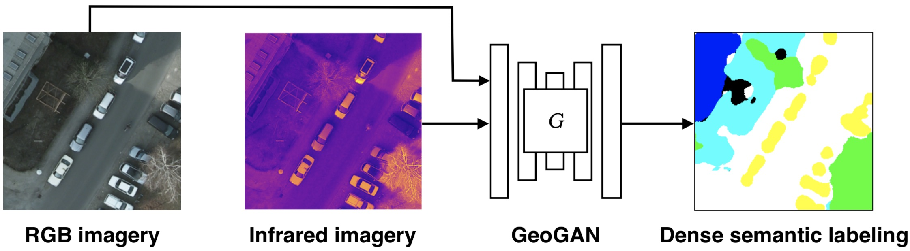

# GeoGAN

This is PyTorch implementation of a GeoGAN network for for dense labeling of RGB+IR optical imagery. The code is based on the [pytorch-CycleGAN-and-pix2pix](https://github.com/junyanz/pytorch-CycleGAN-and-pix2pix)

**GeoGAN: [Project](http://www.zefirus.org/GeoGAN) |  [Paper](http://www.zefirus.org/GeoGAN)**


## Prerequisites
- Linux or macOS
- Python 2 or 3
- CPU or NVIDIA GPU + CUDA CuDNN

## Getting Started
### Installation
- Install PyTorch 0.4, torchvision, and other dependencies from http://pytorch.org
- Install python libraries [visdom](https://github.com/facebookresearch/visdom) and [dominate](https://github.com/Knio/dominate).
```bash
pip install visdom dominate
```
- Alternatively, all dependencies can be installed by
```bash
pip install -r requirements.txt
```
- Clone this repo:
```bash
git clone https://github.com/vlkniaz/GeoGAN.git
cd GeoGAN
```
- For Conda users, we include a script `./scripts/conda_deps.sh` to install PyTorch and other libraries.

### GeoGAN train/test
- Download a GeoGAN dataset (e.g. maps):
```bash
bash ./datasets/download_geogan_dataset.sh maps
```
- Train a model:
```bash
#!./scripts/train_geogan.sh
python train.py --dataroot ./datasets/maps --name maps_geogan --model geo_gan
```
- To view training results and loss plots, run `python -m visdom.server` and click the URL http://localhost:8097. To see more intermediate results, check out `./checkpoints/maps_geogan/web/index.html`
- Test the model:
```bash
#!./scripts/test_geogan.sh
python test.py --dataroot ./datasets/maps --name maps_geogan --model geo_gan
```
The test results will be saved to a html file here: `./results/maps_geogan/latest_test/index.html`.

### Apply a pre-trained model (GeoGAN)
- You can download a pretrained model (e.g. isprs) with the following script:
```bash
bash ./scripts/download_geogan_model.sh isprs
```
The pretrained model is saved at `./checkpoints/{name}_pretrained/latest_net_G.pth`. The available model is isprs.
- To test the model, you also need to download the  isprs dataset:
```bash
bash ./datasets/download_geogan_dataset.sh horse2zebra
```

- Then generate the results using
```bash
python test.py --dataroot datasets/horse2zebra/testA --name horse2zebra_pretrained --model test
```
The option `--model test` is used for generating results of GeoGAN only for one side. `python test.py --model geo_gan` will require loading and generating results in both directions, which is sometimes unnecessary. The results will be saved at `./results/`. Use `--results_dir {directory_path_to_save_result}` to specify the results directory.

## [Datasets](docs/datasets.md)
Download GeoGAN datasets and create your own datasets.

## [Training/Test Tips](docs/tips.md)
Best practice for training and testing your models.

## Citation
If you use this code for your research, please cite our papers.
```
@inproceedings{Kniaz:2018fq,
author = {Kniaz, V V},
title = {{Conditional GANs for Semantic Segmentation of Multispectral Satellite Images}},
booktitle = {SPIE Remote Sensing},
year = {2018},
publisher = {SPIE},
month = sep
}
```


## Related Projects
**[CycleGAN-Torch](https://github.com/junyanz/CycleGAN) |
[pix2pix-Torch](https://github.com/phillipi/pix2pix) | [pix2pixHD](https://github.com/NVIDIA/pix2pixHD) |
[iGAN](https://github.com/junyanz/iGAN) |
[BicycleGAN](https://github.com/junyanz/BicycleGAN)**


## Acknowledgments
Code is inspired by [pytorch-DCGAN](https://github.com/pytorch/examples/tree/master/dcgan).
